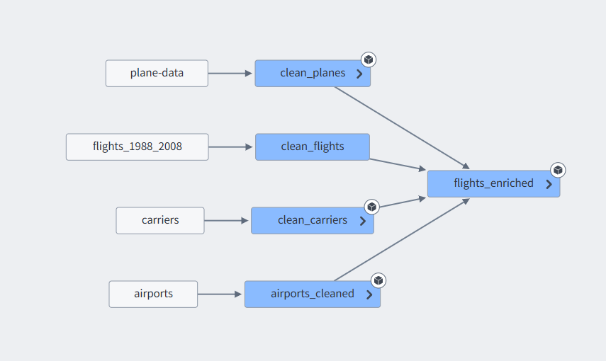

# Airline Operations Dashboard (Palantir Foundry Project)

A comprehensive data engineering and visualization project originally built within **Palantir Foundry**.
This repository demonstrates a full "Data-to-Application" pipeline: from raw data ingestion and PySpark cleaning to Ontology modeling and an operational Dashboard.

---

## Project Overview

**Goal:** Provide airline operations managers with a 360° view of flight punctuality and fleet usage.
**Tech Stack:** Python, PySpark, Palantir Foundry (Workbook, Ontology, Workshop), GitHub Actions.

### Key Features
*   **Robust ETL Pipeline:** Handling data quality issues (1899 epoch dates, missing delays).
*   **Ontology Modeling:** Implementing a "Hub & Spoke" model (Flight ↔ Aircraft/Airport).
*   **Performance Optimization:** Broadcast joins and schema normalization.
*   **Operational Dashboard:** Interactive filtering and metric analysis.

---

## Architecture & Lineage

The pipeline follows a standard Medallion Architecture (Bronze -> Silver -> Gold).

1.  **Raw Layer:** Ingestion of CSV/Parquet files.
2.  **Clean Layer (Silver):** Data typing, standardization, and complex cleaning logic.
3.  **Enriched Layer (Gold):** Star schema formation using `Flight` as the fact table and `Airport`/`Carrier`/`Plane` as dimensions.

---

## Technical Highlights (Code)

The `code/` folder contains the sanitized PySpark logic used in Foundry.

### 1. Advanced Data Cleaning (`clean_flights.py`)
*   **Challenge:** Raw timestamps were based on an archaic 1899 epoch, resulting in negative long values.
*   **Solution:** Custom logic to reconstruct valid ISO 8601 timestamps.
*   **Resiliency:** Implemented a fallback strategy to calculate `DepDelay` dynamically (`Actual - Scheduled`) when source columns are missing.

### 2. Optimization Strategy (`flights_enriched.py`)
*   **Broadcast Joins:** Used `F.broadcast()` for dimension tables to minimize shuffle overhead.
*   **Schema Normalization:** Removed redundant geographical columns from the main Flight table, leveraging Ontology Links instead for retrieval.

### 3. Automated Testing (`tests/`)
*   Unit tests implemented using `pytest` and a local `SparkSession`.
*   Validates edge cases (null values, whitespace handling, date reconstruction).
*   *See the "Passing" badge above confirming tests run successfully in CI.*

---

## Ontology & Data Model

The project leverages the **Foundry Ontology** to transform tabular data into interconnected objects.

### The Graph Model
We moved from flat tables to a graph model:
*   **Flight** is linked to **Origin Airport** and **Destination Airport**.
*   **Flight** is linked to **Aircraft** (via TailNum) and **Carrier**.

*(Insert screenshot of Ontology Graph here if available, e.g., screenshots/ontology_graph.png)*

This allows the dashboard to traverse links (e.g., "Show me all flights arriving at this Airport") instantly without complex SQL joins at query time.

---

## Dashboard (Workshop)

The final application allows users to drill down into 5M+ flights.

**Features shown:**
*   **Aggregation:** Median Delay calculation to handle outliers.
*   **Market Share Analysis:** Breakdown of flights by Carrier.
*   **Object View:** Detailed view of a specific flight with resolved links (Properties panel bottom right).

---

## Repository Structure

*   `code/`: PySpark transformation scripts (Sanitized for public viewing).
*   `tests/`: Unit tests validating the cleaning logic.
*   `screenshots/`: Visual evidence of the Foundry environment and Lineage.
